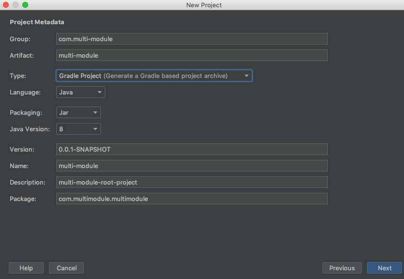

## spring-study-example 


> spring version: spring-boot 2.1.2<br/>
> IDE: STS 4.1.2 for Eclipse <br/>
> java version: 1.8.0_172


* 2019-03-10 --- [HandlerMethodArgumentResolver](#handlermethodargumentresolver)
* 2019-03-16 --- [Spring REST Docs](#spring-rest-docs)
* 2019-06-09 --- [Multi-Module in Spring Project](#multi-module-in-spring-project)

---

## HandlerMethodArgumentResolver 

https://docs.spring.io/spring-framework/docs/current/javadoc-api/org/springframework/web/method/support/HandlerMethodArgumentResolver.html

> Strategy interface for resolving method parameters into argument values in the context of a given request.

> 컨트롤러에 들어오는 파라미터를 커스터마이징할 때 사용할 수 있는 인터페이스로, 공통적으로 수행해야 하는 작업을 수행한 후 해당 Object를 반환함으로써 코드의 중복을 줄일 수 있다. 클라이언트의 요청이 담긴 파라미터를 컨트롤러보다 먼저 받아서 작업을 수행한다. 

| Instance Method                                              | Description                                                  |
| ------------------------------------------------------------ | ------------------------------------------------------------ |
| Object [resolveArgument](https://docs.spring.io/spring-framework/docs/current/javadoc-api/org/springframework/web/method/support/HandlerMethodArgumentResolver.html#resolveArgument-org.springframework.core.MethodParameter-org.springframework.web.method.support.ModelAndViewContainer-org.springframework.web.context.request.NativeWebRequest-org.springframework.web.bind.support.WebDataBinderFactory-)([MethodParameter](https://docs.spring.io/spring-framework/docs/current/javadoc-api/org/springframework/core/MethodParameter.html) parameter, [ModelAndViewContainer](https://docs.spring.io/spring-framework/docs/current/javadoc-api/org/springframework/web/method/support/ModelAndViewContainer.html) mavContainer, [NativeWebRequest](https://docs.spring.io/spring-framework/docs/current/javadoc-api/org/springframework/web/context/request/NativeWebRequest.html) webRequest,[WebDataBinderFactory](https://docs.spring.io/spring-framework/docs/current/javadoc-api/org/springframework/web/bind/support/WebDataBinderFactory.html) binderFactory) | 공통작업 수행 후 리턴                                        |
| boolean supportsParameter(MethodParameter parameter)         | parameter가 해당 resolver에 의해 수행될 수 있는 타입인지 true/false로 리턴. 이 메소드가 먼저 수행되고 true일 시 resolveArgument를 수행한다. |

------

### 예제

1. User 타입의 파라미터를 통해 사용자가 접속한다.
2. User 아이디는 a, b, c 셋 중 하나로 시작한다.
3. a 로 시작하면 관리자, b로 시작하면 vip회원, c로 시작하면 일반회원이다.
4. 각 사용자별로 페이지에 접속할 수 있는 권한이 차등지급된다.
5. 본인이 접속할 수 없는 페이지면 상태코드 403(FORBIDDEN)을 리턴한다. 


1) User 객체생성

```java
package com.edu.tistory.model;

import lombok.Getter;
import lombok.Setter;

@Getter
public class User {
	private String userId;
	private String userPassword;
	@Setter
	private UserType userType;
	
	public enum UserType {
		Manager, VIPMember, Member
	}
}
```


2) LoginUser 어노테이션 생성

```java
package com.edu.tistory.custom;

import java.lang.annotation.Documented;
import java.lang.annotation.ElementType;
import java.lang.annotation.Retention;
import java.lang.annotation.RetentionPolicy;
import java.lang.annotation.Target;

@Target({ElementType.PARAMETER})
@Retention(RetentionPolicy.RUNTIME)
@Documented
public @interface LoginUser {

}

```


2) HandlerMethodArgumentResolver 구현 

```java
package com.edu.tistory.custom;

import org.springframework.core.MethodParameter;
import org.springframework.web.bind.support.WebDataBinderFactory;
import org.springframework.web.context.request.NativeWebRequest;
import org.springframework.web.method.support.HandlerMethodArgumentResolver;
import org.springframework.web.method.support.ModelAndViewContainer;

import com.edu.tistory.model.User;
import com.edu.tistory.model.User.UserType;

public class LoginUserResolver implements HandlerMethodArgumentResolver{

	@Override
	public boolean supportsParameter(MethodParameter parameter) {
		//parameter가 User Type인지 체크 
		return parameter.getParameterType().isAssignableFrom(User.class);
	}

	@Override
	public Object resolveArgument(MethodParameter parameter, ModelAndViewContainer mavContainer,
			NativeWebRequest webRequest, WebDataBinderFactory binderFactory) throws Exception {
	
		User user = new User();		
		
		//User의 id가 시작하는 값에 따라 UserType(Manager, VIPMemeber, Member)차등부여하고 리턴
		String userId= webRequest.getParameter("userId");
		if(userId.charAt(0) == 'a') user.setUserType(UserType.Manager);
		else if(userId.charAt(0)=='b') user.setUserType(UserType.VIPMember);
		else user.setUserType(UserType.Member);
		
		return user;
	}

}

```


4) Controller 구현

```java
package com.edu.tistory.controller;

import org.springframework.http.HttpStatus;
import org.springframework.http.ResponseEntity;
import org.springframework.web.bind.annotation.GetMapping;
import org.springframework.web.bind.annotation.RestController;

import com.edu.tistory.custom.LoginUser;
import com.edu.tistory.model.User;
import com.edu.tistory.model.User.UserType;

@RestController
public class LoginController {

	
	@GetMapping("/login/manager")
	public ResponseEntity<String> pageForManager(@LoginUser User user) {
		// Page for manager
		return getResponseEntity(user, UserType.Manager);
	}
	
	@GetMapping("/login/vip")
	public ResponseEntity<String> pageForVIPMember(@LoginUser User user) {
		// Page for vip
		return getResponseEntity(user, UserType.VIPMember);
	}
	
	@GetMapping("/login/member")
	public ResponseEntity<String> pageForMember(@LoginUser User user) {
		// Page for member
		return getResponseEntity(user,UserType.Member);
	}
	
	public ResponseEntity<String> getResponseEntity(User user, UserType userType) {
		if(user.getUserType()!=userType)
			return new ResponseEntity<>(HttpStatus.FORBIDDEN);
		return new ResponseEntity<String>(HttpStatus.OK);
	}
	
}

```


5) Config 작성 

```java
package com.edu.tistory.config;

import java.util.List;

import org.springframework.context.annotation.Bean;
import org.springframework.context.annotation.Configuration;
import org.springframework.web.method.support.HandlerMethodArgumentResolver;
import org.springframework.web.servlet.config.annotation.WebMvcConfigurer;

import com.edu.tistory.custom.LoginUserResolver;

@Configuration
public class WebConfig implements WebMvcConfigurer{
	
	@Bean
	public LoginUserResolver loginUserResolver() {
		return new LoginUserResolver();
	}
	@Override
	public void addArgumentResolvers(List<HandlerMethodArgumentResolver> resolvers) {
		resolvers.add(loginUserResolver());
		WebMvcConfigurer.super.addArgumentResolvers(resolvers);
	}
}

```


위와 같이 작성 후 userId 에 차이를 주고 url에 접근하면 적절히 resolver가 수행되는 것을 알 수 있다. 


---

## Spring REST Docs

참고링크

<https://docs.spring.io/spring-restdocs/docs/2.0.3.RELEASE/reference/html5/>

<https://cheese10yun.github.io/spring-rest-docs/>

<http://woowabros.github.io/experience/2018/12/28/spring-rest-docs.html>


Spring REST Docs은 snippets을 이용하여 API 명세서를 생성하는 도구로, 기본적으로 [Asciidoctor](http://asciidoctor.org/)를 통해(+markdown도 가능하긴한데 뭔가 많이 복잡하다.)  HTML형식의 문서를 출력한다. snippets을 생성하는 방법에는 Spring MVC의 Test framework(ex: JUnit) WebTestClient, REST Assured3가 있다.


*cf) Spring REST Docs vs Swagger(우아한형제들 기술블로그 펌)*

|      | Spring Rest Docs                | Swagger                                     |
| ---- | ------------------------------- | ------------------------------------------- |
| 장점 | 제품코드에 영향 없다.           | API 를 테스트 해 볼수 있는 화면을 제공한다. |
|      | 테스트가 성공해야 문서작성된다. | 적용하기 쉽다.                              |
| 단점 | 적용하기 어렵다.                | 제품코드에 어노테이션 추가해야한다.         |
|      |                                 | 제품코드와 동기화가 안될수 있다.            |


*실제 Swagger를 적용한 Controller 코드 일부*

```java
@GetMapping()
	@ApiOperation(value="게시글 리스트")
	@ApiImplicitParams({
		@ApiImplicitParam(name = "start", value="글시작번호", required = true, dataType = "int", paramType="query", defaultValue="0"),
		@ApiImplicitParam(name = "end", value="글종료번호", required = true, dataType = "int", paramType="query", defaultValue="10")
	})
	public ResponseEntity<List<Board>> list(@RequestParam(value="start", defaultValue="0") int start,
			@RequestParam(value="end", defaultValue="10") int end ) throws Exception{
		
		List<Board> list= boardService.boardList(start, end);
		return new ResponseEntity<>(list, HttpStatus.OK);	
	}
```

*상단 어노테이션에 해당하는 Api 명세설명과 실제 코드를 일치시키기 위해 결국 개발자가 "직접" 동기화시켜야하고 이에 따라 human error가 일어날 수 있다. 또한, Swagger코드가 길어지면 실제 로직에 대한 가독성이 낮아질 수 있다. 하지만, Postman과 같이 테스트를 할 수 있는 쉽고 예쁜(?) ui를 제공한다는 장점이 있다.*


### Sample Code


**Requirements**

> java 8
>
> Spring Framework5


**Development Environment**

> Spring boot 2.1.3
>
> java8
>
> maven
>
> JUnit4


**pom.xml**

```xml
<dependency> <!-- test 기반이기 때문에 test scope이면 됨-->
	<groupId>org.springframework.restdocs</groupId>
	<artifactId>spring-restdocs-mockmvc</artifactId>
	<version>2.0.3.RELEASE</version>
	<scope>test</scope>
</dependency>

<build>
	<plugins>
		<plugin> <!-- asciidoctor plugin 추가-->
			<groupId>org.asciidoctor</groupId>
			<artifactId>asciidoctor-maven-plugin</artifactId>
			<version>1.5.3</version>
			<executions>
				<execution>
					<id>generate-docs</id>
					<phase>prepare-package</phase> <!-- documentation이 패키지 안에 포함될 수 있도록 허용함-->
					<goals>
						<goal>process-asciidoc</goal>
					</goals>
					<configuration>
						<backend>html</backend>
						<doctype>book</doctype>
					</configuration>
				</execution>
			</executions>
			<dependencies>
				<dependency> <!--자동으로 target/generated-snippets에 snippets 생성-->
					<groupId>org.springframework.restdocs</groupId>
					<artifactId>spring-restdocs-asciidoctor</artifactId>
					<version>2.0.2.RELEASE</version>
				</dependency>
			</dependencies>
		</plugin>
        <plugin> 
	<groupId>org.asciidoctor</groupId>
	<artifactId>asciidoctor-maven-plugin</artifactId>
	<!-- … -->
</plugin>
<plugin> 
	<artifactId>maven-resources-plugin</artifactId>
	<version>2.7</version>
	<executions>
		<execution>
			<id>copy-resources</id>
			<phase>prepare-package</phase>
			<goals>
				<goal>copy-resources</goal>
			</goals>
			<configuration> 
				<outputDirectory><!--생성된 docs를 jar안에 packaging-->
					${project.build.outputDirectory}/static/docs
				</outputDirectory>
				<resources>
					<resource>
						<directory>
							${project.build.directory}/generated-docs
						</directory>
					</resource>
				</resources>
			</configuration>
		</execution>
	</executions>
</plugin>
	</plugins>
</build>
```


기본 설정은 끝났고, 테스팅을 위한 간단한 testcontroller 를 작성했다. 

**SampleTestController.java*

```java
package com.example.demo;

import com.example.demo.model.User;
import org.springframework.http.HttpStatus;
import org.springframework.http.ResponseEntity;
import org.springframework.web.bind.annotation.GetMapping;
import org.springframework.web.bind.annotation.PathVariable;
import org.springframework.web.bind.annotation.PostMapping;
import org.springframework.web.bind.annotation.RestController;

@RestController
public class SampleController {

    @GetMapping("/user/{id}")
    public ResponseEntity<User> getUserInfoById(@PathVariable("id") String id){
        User user = new User();
        user.setId(id);
        user.setName("User1");
        user.setAge(25);
        user.setInfo("This is Test User!!!");
        return new ResponseEntity<>(user, HttpStatus.OK);
    }

    @PostMapping("/user")
    public ResponseEntity<User> createUserByUserModel(User user){
        return new ResponseEntity<>(user, HttpStatus.OK);
    }
}

```


이제 REST Docs 생성과 직접적으로 관련된 Test 코드를 작성한다. 

JUnit4 기반으로 작성하였다.


**SampleControllerTest.java**

```java
package com.example.demo;

import org.junit.Before;
import org.junit.Rule;
import org.junit.Test;
import org.junit.runner.RunWith;
import org.springframework.beans.factory.annotation.Autowired;
import org.springframework.boot.test.context.SpringBootTest;
import org.springframework.restdocs.JUnitRestDocumentation;
import org.springframework.test.context.junit4.SpringRunner;
import org.springframework.test.web.servlet.MockMvc;
import org.springframework.test.web.servlet.setup.MockMvcBuilders;
import org.springframework.web.context.WebApplicationContext;


import static org.springframework.restdocs.mockmvc.MockMvcRestDocumentation.document;
import static org.springframework.restdocs.mockmvc.MockMvcRestDocumentation.documentationConfiguration;
import static org.springframework.restdocs.payload.PayloadDocumentation.*;
import static org.springframework.test.web.servlet.request.MockMvcRequestBuilders.get;
import static org.springframework.test.web.servlet.request.MockMvcRequestBuilders.post;
import static org.springframework.test.web.servlet.result.MockMvcResultHandlers.print;
import static org.springframework.test.web.servlet.result.MockMvcResultMatchers.status;
import static org.springframework.restdocs.request.RequestDocumentation.requestParameters;
import static org.springframework.restdocs.request.RequestDocumentation.parameterWithName;


@RunWith(SpringRunner.class)
@SpringBootTest(classes = DemoApplication.class)
public class SampleControllerTest {

     /* snippets이 생성될 위치를 지정하는 부분으로 아무것도 지정하지 않을 시
    Maven의 경우, target/generated-snippets
    Gradle의 경우, build/generated-snippets
    에 생성된다.*/
    @Rule
    public JUnitRestDocumentation restDocumentation = new JUnitRestDocumentation();

    private MockMvc mockMvc;


    @Autowired
    private WebApplicationContext context;

    @Before
    public void setUp() {
        this.mockMvc = MockMvcBuilders.webAppContextSetup(this.context)
                .apply(documentationConfiguration(this.restDocumentation))
                .alwaysDo(document("{method-name}/{class-name}"))
                .build();
    }

    @Test
    public void getUserInfoById() throws Exception{
        this.mockMvc.perform(get("/user/user1"))
                .andDo(print())
                .andExpect(status().isOk())
                .andDo(document("index",
                        responseFields(
                                fieldWithPath("id").description("The Board's number"),
                                fieldWithPath("name").description("The Board's title"),
                                fieldWithPath("age").description("The Board's contents"),
                                fieldWithPath("info").description("The Board's writeName")
                               )
                ));

    }

    @Test
    public void createUserByUserModel() throws  Exception{
        this.mockMvc.perform(post("/user")
                                .param("id", "user1")
                                .param("name","username1")
                                .param("age", "22")
                                .param("info", "Is this Alright?"))
                            .andDo(print())
                            .andExpect(status().isOk())
                            .andDo(document("index",requestParameters(
                                    parameterWithName("id").description("User's id"),
                                    parameterWithName("name").description("User's name"),
                                    parameterWithName("age").description("User's age"),
                                    parameterWithName("info").description("User's info")),
                                    responseFields(
                                        fieldWithPath("id").description("The Board's number"),
                                        fieldWithPath("name").description("The Board's title"),
                                        fieldWithPath("age").description("The Board's contents"),
                                        fieldWithPath("info").description("The Board's writeName")
                                )
                            ));


    }
}


```


(1) 테스팅 결과로 나오는 파일을 명명 규칙을 지정한다. 해당 설정을 해주면 generated-snippets/{method-name}/{class-name} 디렉토리가 생성되고 그 아래 adoc파일이 생성된다. 

여기에서

```java
  responseFields(
                                    fieldWithPath("id").description("The Board's number"),
                                    fieldWithPath("name").description("The Board's title"),
                                    fieldWithPath("age").description("The Board's contents"),
                                    fieldWithPath("info").description("The Board's writeName")
                                )
```

이부분만 각자의 api 응답에 따라 작성해주면된다.

fieldWithPath("응답데이터").description("설명") 

이런식으로!


그 후, <u>테스트가 정상적으로 성공한다면</u> target 디렉토리에 다음과 같은 폴더들이 생성된다.


**src/main아래에 asciidoc 폴더를 생성하고 api-docs.adoc 라는 파일을 하나 생성한 뒤 다음과 같이 입력한다.**


asciidoc 문법은 <https://asciidoctor.org/docs/asciidoc-syntax-quick-reference/> 에서 볼 수 있다. 마크다운이랑 비슷한 수준인 것 같다.


**src/main/asciidoc/api-docs.adoc**

```asciiarmor
= Sample Project API 명세 (Spring REST Docs)

== getUserInfoById

=== Curl request

include::{snippets}/get-user-info-by-id/sample-controller-test/curl-request.adoc[]

=== HTTP request

include::{snippets}/get-user-info-by-id/sample-controller-test/http-request.adoc[]

=== HTTP response

include::{snippets}/get-user-info-by-id/sample-controller-test/http-response.adoc[]


=== request body

include::{snippets}/get-user-info-by-id/sample-controller-test/request-body.adoc[]


=== response body

include::{snippets}/get-user-info-by-id/sample-controller-test/response-body.adoc[]


== CreateUserByUserModel

=== Curl request

include::{snippets}/create-user-by-user-model/sample-controller-test/curl-request.adoc[]

=== HTTP request

include::{snippets}/create-user-by-user-model/sample-controller-test/http-request.adoc[]

=== HTTP response

include::{snippets}/create-user-by-user-model/sample-controller-test/http-response.adoc[]


=== request body

include::{snippets}/create-user-by-user-model/sample-controller-test/request-body.adoc[]


=== response body

include::{snippets}/create-user-by-user-model/sample-controller-test/response-body.adoc[]


```


이제 정말 끝 

**maven install을 실행한다.**


빌드가 성공적으로 되었다면, target/generated-docs에 api-docs.html 파일이 생길 것이다.

이제 서버를 기동시키고 localhost:port/docs/api-docs.html 을 접속해보자.


-끝-


Swagger에 비해 훨씬 복잡하고 test를 하나하나 작성해야 문서에 반영된다는 점이 좀 귀찮긴 했지만, 다시 생각해 보면 "테스트"를 작성해야 한다는 점이 장점이라는 생각이 들었다. 테스팅을 성공하지 않으면 문서 자체를 만들 수 없기 때문에 실제 코드와 일치하는 API 명세를 보장할 수 있다. 혼자 개발할 땐 편하게 쓸 수 있는 Swagger를, 실제 명세가 필요할 땐 REST Docs를 이용하지 않을까싶다.


---


## Multi module in Spring Project

참고링크

https://jojoldu.tistory.com/123


**멀티모듈?**

> 일반적인 프로젝트는 다수의 프로젝트 폴더의 집합으로 구성된다.
>
> 이때, 여러 프로젝트에서 사용되는 모듈이 있을 수 있는데 공통의 모듈을 root project에서 다른 subproject에 포함시킬 수 있다.
>
> 공통의 모듈을 복사/붙여넣지 않고 include 하여 사용함으로써 코드의 중복을 줄일 수 있고 변경 시 해당 공통 모듈만 변경하면 되기 때문에 human-error를 방지할 수 있다.


**Environment**

> IntelliJ
>
> Java 8
>
> Gradle
>
> Spring boot 2.1.5


> 로그인 기능을 구현한다.
>
> Account 클래스는 API에서도, Fo에서도 사용되는 Entity이다.
>
> Account 클래스를 공통 모듈로 구성하고 API와 Fo 모두에서 사용한다.
>
> root project를 빌드하고 실행한다.


**1. root Project 생성**




**2. module project생성**

root project에서 new > Module 을 통해 모듈 프로젝트를 추가할 수 있다(IntelliJ 기준)

(주의할 점은 spring initializer로 모듈을 추가하는 것이 아닌 gradle 로 추가해야한다는 점. 이것 때문에 생난리난리퓨)

공통모듈인 core 프로젝트, api 프로젝트, fo 프로젝트를 생성한다.

 

>  package 구조


gradle module을 추가하면 자동적으로 settings.gradle이 하단과 같이 변경된다.

```
pluginManagement {
	repositories {
		gradlePluginPortal()
	}
}
rootProject.name = 'root-project'
include 'module-api'
include 'module-core'
include 'module-fo'
```


<u>api module 은  service 관련 로직만 포함하기 때문에</u>

```
dependencies {
    testCompile('org.springframework.boot:spring-boot-starter-test')
    implementation 'org.projectlombok:lombok'
}
```


<u>fo module은 controller 작성 용도로만 사용하기 때문에</u>

```
dependencies {
    testCompile group: 'junit', name: 'junit', version: '4.12'
}
```


<u>core module 은 jpa, lombok, h2를 추가해주었다.</u>

```
dependencies {
    compile('org.springframework.boot:spring-boot-starter-data-jpa')
    runtime('com.h2database:h2')
    testCompile('org.springframework.boot:spring-boot-starter-test')
    implementation 'org.projectlombok:lombok'
}
```


**3. core 모듈 Account Class와 Respository 작성**


<u>Account.java</u>

```java
package com.multimodule.core;

import lombok.Builder;
import lombok.Getter;
import lombok.Setter;

import javax.persistence.Entity;
import javax.persistence.GeneratedValue;
import javax.persistence.GenerationType;
import javax.persistence.Id;

@NoArgsConstructor(access = AccessLevel.PROTECTED)
@Getter
@Entity
public class Account {

    @Id
    @GeneratedValue(strategy = GenerationType.AUTO)
    private Long id;

    private String userName;

    private String password;

    @Builder
    public Account(String userName, String password) {
        this.userName = userName;
        this.password = password;
    }

}

```


<u>AccountRepository.java</u>

```java
package com.multimodule.core;

import org.springframework.data.jpa.repository.JpaRepository;
import org.springframework.stereotype.Repository;

public interface AccountRepository extends JpaRepository<Account, Long> {
}

```


**4. 위의 공통모듈을 다른 하위 모듈에 include 시키기 위해 root project 의 build.gradle을 수정한다.**

```
plugins {
    id 'org.springframework.boot' version '2.1.5.RELEASE'
    id 'java'
}

apply plugin: 'io.spring.dependency-management'

group = 'com.multi-module'
version = '0.0.1-SNAPSHOT'
sourceCompatibility = '1.8'

configurations {
    compileOnly {
        extendsFrom annotationProcessor
    }
}

repositories {
    mavenCentral()
}

dependencies {
    testImplementation 'org.springframework.boot:spring-boot-starter-test'
}

subprojects {

    apply plugin: 'java'
    apply plugin: 'org.springframework.boot'
    apply plugin: 'io.spring.dependency-management'

    sourceCompatibility = 1.8

    repositories {
        mavenCentral()
    }
    
    dependencies {
        testCompile group: 'junit', name: 'junit', version: '4.12'
        implementation 'org.springframework.boot:spring-boot-starter-web'
        annotationProcessor 'org.projectlombok:lombok'
    }
}

project(':module-api') {
    dependencies {
        compile project(':module-core')
    }
}

project(':module-fo') {
    dependencies {
        compile project(':modudle-core')
    }
}
```


subproject의 사항들이 모두 하위 모듈에 적용된다.


```
apply plugin: 'org.springframework.boot'
```

위 설정을 통해 각 프로젝트가 spring boot 의존성을 가질 수 있도록 한다.(현재는 gradle 프로젝트이기 때문에)


또, 

```
 dependencies {
        testCompile group: 'junit', name: 'junit', version: '4.12'
        implementation 'org.springframework.boot:spring-boot-starter-web'
        annotationProcessor 'org.projectlombok:lombok'
    }
```

subproejct dependencies에 공통적으로 포함되는 의존을 기입함으로써 중복코드를 줄일 수도 있다.

모든 모듈에 공통적으로 필요한 세 의존을 기입했다.


마지막으로,

```
project(':module-api') {
    dependencies {
        compile project(':module-core')
    }
}

project(':module-fo') {
    dependencies {
        compile project(':modudle-core')
    }
}
```

설정을 통해 공통 모듈을 두 모듈에 주입시켜준다.


**5. API에 Service class 생성**

공통모듈을 사용할 수 있는 상태가 되었으니 multimodule-api 프로젝트에서 service 클래스를 구현한다.


<u>MemberService.java</u>

```java
package com.module.api.service;


import com.module.common.domain.Member;
import com.module.common.domain.MemberRepository;
import lombok.AllArgsConstructor;
import org.springframework.stereotype.Service;

@Service
@AllArgsConstructor
public class MemberService {

    private MemberRepository memberRepository;

    public Long signUp(Member member) {
        return memberRepository.save(member).getId();
    }

}
```

~~memberRepository의 메서드가 제대로 적용이안되면 core의 dependency를 확인해보자.~~

~~lombok 의존이 complieOnly라면 implementation으로 변경하고 저장하고 다시 확인해보자.~~


**6. FoController 생성**

테스트 용이기에 약간 이상하긴하지만,


```java
package com.module.fo.controller;

import com.module.core.domain.Account;
import org.springframework.web.bind.annotation.GetMapping;
import org.springframework.web.bind.annotation.RestController;

@RestController
public class FoController {
    @GetMapping("/")
    public Account signUp(){
        Account account = Account.builder()
                .userName("user1")
                .password("password")
                .build();

        return account;
    }
}

```


모든 프로젝트 생성이 끝났다.

이제 전체 프로젝트를 빌드하기전에 

module-fo와 module-api는 서버를 띄워야하기 때문에 main클래스가 필요하지만 module-core은 말그대로 공통 클래스인 Account와 AccountRepository만을 포함한다. 즉, 서버를 띄울필요가 없다.

따라서 하단의 설정을 module-core의 build.gradle에 추가함으로써 main클래스 없이도 빌드가 가능하도록 한다.


```
bootJar.enabled=false
jar.enabled=true
```


**7. 전체프로젝트 빌드와 에러에러에러에러**


~~dependency complie이 꼬이는지 어째는지 계속 됐다가 안됐다가~~ 

~~특히나 module-api에서 AccountRepository bean creating error가 나다가 안나다가 난리여서 한참 헤맸다.~~


~~module-api에 spring-data-jpa 의존을 추가하고,~~

~~main 클래스를 다음과 같이 바꿔준다~~

```java
package com.module.api;

import org.springframework.boot.SpringApplication;
import org.springframework.boot.autoconfigure.SpringBootApplication;
import org.springframework.boot.autoconfigure.domain.EntityScan;
import org.springframework.data.jpa.repository.config.EnableJpaRepositories;

@SpringBootApplication
@EnableJpaRepositories(basePackages = {"com.module.core.domain"})
@EntityScan(basePackages = {"com.module.core.domain"})
public class ModuleApiApplication {
    public static void main(String[] args){
        SpringApplication.run(ModuleApiApplication.class, args);
    }
}

```


~~Repository와 Entity 를 명시해주었더니 위와같은 에러가 나지 않고 정상적으로 빌드되었다.~~


++ 는 잘못된 해결책이었음!

api 패키지가 com.module.api부터 시작하고 메인이 그 아래에 있어서

com.module.core 아래의 bean들을 읽지 못하는 것이었다.

api main을 com.module로 이동시키고 나니 정상적으로 수행되었다:) 

