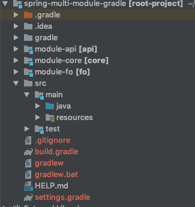

## spring-study-example 


* 2019-03-10 --- [HandlerMethodArgumentResolver](#handlermethodargumentresolver)

* 2019-03-16 --- [Spring REST Docs](#spring-rest-docs)

* 2019-06-09 --- [Multi-Module in Spring Project](#multi-module-in-spring-project)

* 2019-07-14 --- [Webpack in Spring boot Project](#webpack)

* 2019-07-17---[RestTemplate으로 통신하기 리뉴얼버전](#resttemplate)

  

---

## HandlerMethodArgumentResolver 

https://docs.spring.io/spring-framework/docs/current/javadoc-api/org/springframework/web/method/support/HandlerMethodArgumentResolver.html

> Strategy interface for resolving method parameters into argument values in the context of a given request.

> 컨트롤러에 들어오는 파라미터를 커스터마이징할 때 사용할 수 있는 인터페이스로, 공통적으로 수행해야 하는 작업을 수행한 후 해당 Object를 반환함으로써 코드의 중복을 줄일 수 있다. 클라이언트의 요청이 담긴 파라미터를 컨트롤러보다 먼저 받아서 작업을 수행한다. 

| Instance Method                                              | Description                                                  |
| ------------------------------------------------------------ | ------------------------------------------------------------ |
| Object [resolveArgument](https://docs.spring.io/spring-framework/docs/current/javadoc-api/org/springframework/web/method/support/HandlerMethodArgumentResolver.html#resolveArgument-org.springframework.core.MethodParameter-org.springframework.web.method.support.ModelAndViewContainer-org.springframework.web.context.request.NativeWebRequest-org.springframework.web.bind.support.WebDataBinderFactory-)([MethodParameter](https://docs.spring.io/spring-framework/docs/current/javadoc-api/org/springframework/core/MethodParameter.html) parameter, [ModelAndViewContainer](https://docs.spring.io/spring-framework/docs/current/javadoc-api/org/springframework/web/method/support/ModelAndViewContainer.html) mavContainer, [NativeWebRequest](https://docs.spring.io/spring-framework/docs/current/javadoc-api/org/springframework/web/context/request/NativeWebRequest.html) webRequest,[WebDataBinderFactory](https://docs.spring.io/spring-framework/docs/current/javadoc-api/org/springframework/web/bind/support/WebDataBinderFactory.html) binderFactory) | 공통작업 수행 후 리턴                                        |
| boolean supportsParameter(MethodParameter parameter)         | parameter가 해당 resolver에 의해 수행될 수 있는 타입인지 true/false로 리턴. 이 메소드가 먼저 수행되고 true일 시 resolveArgument를 수행한다. |

------

### 예제

1. User 타입의 파라미터를 통해 사용자가 접속한다.
2. User 아이디는 a, b, c 셋 중 하나로 시작한다.
3. a 로 시작하면 관리자, b로 시작하면 vip회원, c로 시작하면 일반회원이다.
4. 각 사용자별로 페이지에 접속할 수 있는 권한이 차등지급된다.
5. 본인이 접속할 수 없는 페이지면 상태코드 403(FORBIDDEN)을 리턴한다. 


1) User 객체생성

```java
package com.edu.tistory.model;

import lombok.Getter;
import lombok.Setter;

@Getter
public class User {
	private String userId;
	private String userPassword;
	@Setter
	private UserType userType;
	
	public enum UserType {
		Manager, VIPMember, Member
	}
}
```


2) LoginUser 어노테이션 생성

```java
package com.edu.tistory.custom;

import java.lang.annotation.Documented;
import java.lang.annotation.ElementType;
import java.lang.annotation.Retention;
import java.lang.annotation.RetentionPolicy;
import java.lang.annotation.Target;

@Target({ElementType.PARAMETER})
@Retention(RetentionPolicy.RUNTIME)
@Documented
public @interface LoginUser {

}

```


2) HandlerMethodArgumentResolver 구현 

```java
package com.edu.tistory.custom;

import org.springframework.core.MethodParameter;
import org.springframework.web.bind.support.WebDataBinderFactory;
import org.springframework.web.context.request.NativeWebRequest;
import org.springframework.web.method.support.HandlerMethodArgumentResolver;
import org.springframework.web.method.support.ModelAndViewContainer;

import com.edu.tistory.model.User;
import com.edu.tistory.model.User.UserType;

public class LoginUserResolver implements HandlerMethodArgumentResolver{

	@Override
	public boolean supportsParameter(MethodParameter parameter) {
		//parameter가 User Type인지 체크 
		return parameter.getParameterType().isAssignableFrom(User.class) 
      && parameter.hasParameterAnnotation(Auth.class);
	}

	@Override
	public Object resolveArgument(MethodParameter parameter, ModelAndViewContainer mavContainer,
			NativeWebRequest webRequest, WebDataBinderFactory binderFactory) throws Exception {
	
		User user = new User();		
		
		//User의 id가 시작하는 값에 따라 UserType(Manager, VIPMemeber, Member)차등부여하고 리턴
		String userId= webRequest.getParameter("userId");
		if(userId.charAt(0) == 'a') user.setUserType(UserType.Manager);
		else if(userId.charAt(0)=='b') user.setUserType(UserType.VIPMember);
		else user.setUserType(UserType.Member);
		
		return user;
	}

}

```


4) Controller 구현

```java
package com.edu.tistory.controller;

import org.springframework.http.HttpStatus;
import org.springframework.http.ResponseEntity;
import org.springframework.web.bind.annotation.GetMapping;
import org.springframework.web.bind.annotation.RestController;

import com.edu.tistory.custom.LoginUser;
import com.edu.tistory.model.User;
import com.edu.tistory.model.User.UserType;

@RestController
public class LoginController {

	
	@GetMapping("/login/manager")
	public ResponseEntity<String> pageForManager(@LoginUser User user) {
		// Page for manager
		return getResponseEntity(user, UserType.Manager);
	}
	
	@GetMapping("/login/vip")
	public ResponseEntity<String> pageForVIPMember(@LoginUser User user) {
		// Page for vip
		return getResponseEntity(user, UserType.VIPMember);
	}
	
	@GetMapping("/login/member")
	public ResponseEntity<String> pageForMember(@LoginUser User user) {
		// Page for member
		return getResponseEntity(user,UserType.Member);
	}
	
	public ResponseEntity<String> getResponseEntity(User user, UserType userType) {
		if(user.getUserType()!=userType)
			return new ResponseEntity<>(HttpStatus.FORBIDDEN);
		return new ResponseEntity<String>(HttpStatus.OK);
	}
	
}

```


5) Config 작성 

```java
package com.edu.tistory.config;

import java.util.List;

import org.springframework.context.annotation.Bean;
import org.springframework.context.annotation.Configuration;
import org.springframework.web.method.support.HandlerMethodArgumentResolver;
import org.springframework.web.servlet.config.annotation.WebMvcConfigurer;

import com.edu.tistory.custom.LoginUserResolver;

@Configuration
public class WebConfig implements WebMvcConfigurer{
	
	@Bean
	public LoginUserResolver loginUserResolver() {
		return new LoginUserResolver();
	}
	@Override
	public void addArgumentResolvers(List<HandlerMethodArgumentResolver> resolvers) {
		resolvers.add(loginUserResolver());
		WebMvcConfigurer.super.addArgumentResolvers(resolvers);
	}
}

```


위와 같이 작성 후 userId 에 차이를 주고 url에 접근하면 적절히 resolver가 수행되는 것을 알 수 있다. 


---

## Spring REST Docs

참고링크

<https://docs.spring.io/spring-restdocs/docs/2.0.3.RELEASE/reference/html5/>

<https://cheese10yun.github.io/spring-rest-docs/>

<http://woowabros.github.io/experience/2018/12/28/spring-rest-docs.html>


Spring REST Docs은 snippets을 이용하여 API 명세서를 생성하는 도구로, 기본적으로 [Asciidoctor](http://asciidoctor.org/)를 통해(+markdown도 가능하긴한데 뭔가 많이 복잡하다.)  HTML형식의 문서를 출력한다. snippets을 생성하는 방법에는 Spring MVC의 Test framework(ex: JUnit) WebTestClient, REST Assured3가 있다.


*cf) Spring REST Docs vs Swagger(우아한형제들 기술블로그 펌)*

|      | Spring Rest Docs                | Swagger                                     |
| ---- | ------------------------------- | ------------------------------------------- |
| 장점 | 제품코드에 영향 없다.           | API 를 테스트 해 볼수 있는 화면을 제공한다. |
|      | 테스트가 성공해야 문서작성된다. | 적용하기 쉽다.                              |
| 단점 | 적용하기 어렵다.                | 제품코드에 어노테이션 추가해야한다.         |
|      |                                 | 제품코드와 동기화가 안될수 있다.            |


*실제 Swagger를 적용한 Controller 코드 일부*

```java
@GetMapping()
	@ApiOperation(value="게시글 리스트")
	@ApiImplicitParams({
		@ApiImplicitParam(name = "start", value="글시작번호", required = true, dataType = "int", paramType="query", defaultValue="0"),
		@ApiImplicitParam(name = "end", value="글종료번호", required = true, dataType = "int", paramType="query", defaultValue="10")
	})
	public ResponseEntity<List<Board>> list(@RequestParam(value="start", defaultValue="0") int start,
			@RequestParam(value="end", defaultValue="10") int end ) throws Exception{
		
		List<Board> list= boardService.boardList(start, end);
		return new ResponseEntity<>(list, HttpStatus.OK);	
	}
```

*상단 어노테이션에 해당하는 Api 명세설명과 실제 코드를 일치시키기 위해 결국 개발자가 "직접" 동기화시켜야하고 이에 따라 human error가 일어날 수 있다. 또한, Swagger코드가 길어지면 실제 로직에 대한 가독성이 낮아질 수 있다. 하지만, Postman과 같이 테스트를 할 수 있는 쉽고 예쁜(?) ui를 제공한다는 장점이 있다.*


### Sample Code


**Requirements**

> java 8
>
> Spring Framework5


**Development Environment**

> Spring boot 2.1.3
>
> java8
>
> maven
>
> JUnit4


**pom.xml**

```xml
<dependency> <!-- test 기반이기 때문에 test scope이면 됨-->
	<groupId>org.springframework.restdocs</groupId>
	<artifactId>spring-restdocs-mockmvc</artifactId>
	<version>2.0.3.RELEASE</version>
	<scope>test</scope>
</dependency>

<build>
	<plugins>
		<plugin> <!-- asciidoctor plugin 추가-->
			<groupId>org.asciidoctor</groupId>
			<artifactId>asciidoctor-maven-plugin</artifactId>
			<version>1.5.3</version>
			<executions>
				<execution>
					<id>generate-docs</id>
					<phase>prepare-package</phase> <!-- documentation이 패키지 안에 포함될 수 있도록 허용함-->
					<goals>
						<goal>process-asciidoc</goal>
					</goals>
					<configuration>
						<backend>html</backend>
						<doctype>book</doctype>
					</configuration>
				</execution>
			</executions>
			<dependencies>
				<dependency> <!--자동으로 target/generated-snippets에 snippets 생성-->
					<groupId>org.springframework.restdocs</groupId>
					<artifactId>spring-restdocs-asciidoctor</artifactId>
					<version>2.0.2.RELEASE</version>
				</dependency>
			</dependencies>
		</plugin>
        <plugin> 
	<groupId>org.asciidoctor</groupId>
	<artifactId>asciidoctor-maven-plugin</artifactId>
	<!-- … -->
</plugin>
<plugin> 
	<artifactId>maven-resources-plugin</artifactId>
	<version>2.7</version>
	<executions>
		<execution>
			<id>copy-resources</id>
			<phase>prepare-package</phase>
			<goals>
				<goal>copy-resources</goal>
			</goals>
			<configuration> 
				<outputDirectory><!--생성된 docs를 jar안에 packaging-->
					${project.build.outputDirectory}/static/docs
				</outputDirectory>
				<resources>
					<resource>
						<directory>
							${project.build.directory}/generated-docs
						</directory>
					</resource>
				</resources>
			</configuration>
		</execution>
	</executions>
</plugin>
	</plugins>
</build>
```


기본 설정은 끝났고, 테스팅을 위한 간단한 testcontroller 를 작성했다. 

**SampleTestController.java*

```java
package com.example.demo;

import com.example.demo.model.User;
import org.springframework.http.HttpStatus;
import org.springframework.http.ResponseEntity;
import org.springframework.web.bind.annotation.GetMapping;
import org.springframework.web.bind.annotation.PathVariable;
import org.springframework.web.bind.annotation.PostMapping;
import org.springframework.web.bind.annotation.RestController;

@RestController
public class SampleController {

    @GetMapping("/user/{id}")
    public ResponseEntity<User> getUserInfoById(@PathVariable("id") String id){
        User user = new User();
        user.setId(id);
        user.setName("User1");
        user.setAge(25);
        user.setInfo("This is Test User!!!");
        return new ResponseEntity<>(user, HttpStatus.OK);
    }

    @PostMapping("/user")
    public ResponseEntity<User> createUserByUserModel(User user){
        return new ResponseEntity<>(user, HttpStatus.OK);
    }
}

```


이제 REST Docs 생성과 직접적으로 관련된 Test 코드를 작성한다. 

JUnit4 기반으로 작성하였다.


**SampleControllerTest.java**

```java
package com.example.demo;

import org.junit.Before;
import org.junit.Rule;
import org.junit.Test;
import org.junit.runner.RunWith;
import org.springframework.beans.factory.annotation.Autowired;
import org.springframework.boot.test.context.SpringBootTest;
import org.springframework.restdocs.JUnitRestDocumentation;
import org.springframework.test.context.junit4.SpringRunner;
import org.springframework.test.web.servlet.MockMvc;
import org.springframework.test.web.servlet.setup.MockMvcBuilders;
import org.springframework.web.context.WebApplicationContext;


import static org.springframework.restdocs.mockmvc.MockMvcRestDocumentation.document;
import static org.springframework.restdocs.mockmvc.MockMvcRestDocumentation.documentationConfiguration;
import static org.springframework.restdocs.payload.PayloadDocumentation.*;
import static org.springframework.test.web.servlet.request.MockMvcRequestBuilders.get;
import static org.springframework.test.web.servlet.request.MockMvcRequestBuilders.post;
import static org.springframework.test.web.servlet.result.MockMvcResultHandlers.print;
import static org.springframework.test.web.servlet.result.MockMvcResultMatchers.status;
import static org.springframework.restdocs.request.RequestDocumentation.requestParameters;
import static org.springframework.restdocs.request.RequestDocumentation.parameterWithName;


@RunWith(SpringRunner.class)
@SpringBootTest(classes = DemoApplication.class)
public class SampleControllerTest {

     /* snippets이 생성될 위치를 지정하는 부분으로 아무것도 지정하지 않을 시
    Maven의 경우, target/generated-snippets
    Gradle의 경우, build/generated-snippets
    에 생성된다.*/
    @Rule
    public JUnitRestDocumentation restDocumentation = new JUnitRestDocumentation();

    private MockMvc mockMvc;


    @Autowired
    private WebApplicationContext context;

    @Before
    public void setUp() {
        this.mockMvc = MockMvcBuilders.webAppContextSetup(this.context)
                .apply(documentationConfiguration(this.restDocumentation))
                .alwaysDo(document("{method-name}/{class-name}"))
                .build();
    }

    @Test
    public void getUserInfoById() throws Exception{
        this.mockMvc.perform(get("/user/user1"))
                .andDo(print())
                .andExpect(status().isOk())
                .andDo(document("index",
                        responseFields(
                                fieldWithPath("id").description("The Board's number"),
                                fieldWithPath("name").description("The Board's title"),
                                fieldWithPath("age").description("The Board's contents"),
                                fieldWithPath("info").description("The Board's writeName")
                               )
                ));

    }

    @Test
    public void createUserByUserModel() throws  Exception{
        this.mockMvc.perform(post("/user")
                                .param("id", "user1")
                                .param("name","username1")
                                .param("age", "22")
                                .param("info", "Is this Alright?"))
                            .andDo(print())
                            .andExpect(status().isOk())
                            .andDo(document("index",requestParameters(
                                    parameterWithName("id").description("User's id"),
                                    parameterWithName("name").description("User's name"),
                                    parameterWithName("age").description("User's age"),
                                    parameterWithName("info").description("User's info")),
                                    responseFields(
                                        fieldWithPath("id").description("The Board's number"),
                                        fieldWithPath("name").description("The Board's title"),
                                        fieldWithPath("age").description("The Board's contents"),
                                        fieldWithPath("info").description("The Board's writeName")
                                )
                            ));


    }
}


```


(1) 테스팅 결과로 나오는 파일을 명명 규칙을 지정한다. 해당 설정을 해주면 generated-snippets/{method-name}/{class-name} 디렉토리가 생성되고 그 아래 adoc파일이 생성된다. 

여기에서

```java
  responseFields(
                                    fieldWithPath("id").description("The Board's number"),
                                    fieldWithPath("name").description("The Board's title"),
                                    fieldWithPath("age").description("The Board's contents"),
                                    fieldWithPath("info").description("The Board's writeName")
                                )
```

이부분만 각자의 api 응답에 따라 작성해주면된다.

fieldWithPath("응답데이터").description("설명") 

이런식으로!


그 후, <u>테스트가 정상적으로 성공한다면</u> target 디렉토리에 다음과 같은 폴더들이 생성된다.


**src/main아래에 asciidoc 폴더를 생성하고 api-docs.adoc 라는 파일을 하나 생성한 뒤 다음과 같이 입력한다.**


asciidoc 문법은 <https://asciidoctor.org/docs/asciidoc-syntax-quick-reference/> 에서 볼 수 있다. 마크다운이랑 비슷한 수준인 것 같다.


**src/main/asciidoc/api-docs.adoc**

```asciiarmor
= Sample Project API 명세 (Spring REST Docs)

== getUserInfoById

=== Curl request

include::{snippets}/get-user-info-by-id/sample-controller-test/curl-request.adoc[]

=== HTTP request

include::{snippets}/get-user-info-by-id/sample-controller-test/http-request.adoc[]

=== HTTP response

include::{snippets}/get-user-info-by-id/sample-controller-test/http-response.adoc[]


=== request body

include::{snippets}/get-user-info-by-id/sample-controller-test/request-body.adoc[]


=== response body

include::{snippets}/get-user-info-by-id/sample-controller-test/response-body.adoc[]


== CreateUserByUserModel

=== Curl request

include::{snippets}/create-user-by-user-model/sample-controller-test/curl-request.adoc[]

=== HTTP request

include::{snippets}/create-user-by-user-model/sample-controller-test/http-request.adoc[]

=== HTTP response

include::{snippets}/create-user-by-user-model/sample-controller-test/http-response.adoc[]


=== request body

include::{snippets}/create-user-by-user-model/sample-controller-test/request-body.adoc[]


=== response body

include::{snippets}/create-user-by-user-model/sample-controller-test/response-body.adoc[]


```


이제 정말 끝 

**maven install을 실행한다.**


빌드가 성공적으로 되었다면, target/generated-docs에 api-docs.html 파일이 생길 것이다.

이제 서버를 기동시키고 localhost:port/docs/api-docs.html 을 접속해보자.


-끝-


Swagger에 비해 훨씬 복잡하고 test를 하나하나 작성해야 문서에 반영된다는 점이 좀 귀찮긴 했지만, 다시 생각해 보면 "테스트"를 작성해야 한다는 점이 장점이라는 생각이 들었다. 테스팅을 성공하지 않으면 문서 자체를 만들 수 없기 때문에 실제 코드와 일치하는 API 명세를 보장할 수 있다. 혼자 개발할 땐 편하게 쓸 수 있는 Swagger를, 실제 명세가 필요할 땐 REST Docs를 이용하지 않을까싶다.


---


## Multi module in Spring Project

참고링크

https://jojoldu.tistory.com/123


**멀티모듈?**

> 일반적인 프로젝트는 다수의 프로젝트 폴더의 집합으로 구성된다.
>
> 이때, 여러 프로젝트에서 사용되는 모듈이 있을 수 있는데 공통의 모듈을 root project에서 다른 subproject에 포함시킬 수 있다.
>
> 공통의 모듈을 복사/붙여넣지 않고 include 하여 사용함으로써 코드의 중복을 줄일 수 있고 변경 시 해당 공통 모듈만 변경하면 되기 때문에 human-error를 방지할 수 있다.


**Environment**

> IntelliJ
>
> Java 8
>
> Gradle
>
> Spring boot 2.1.5


> 로그인 기능을 구현한다.
>
> Account 클래스는 API에서도, Fo에서도 사용되는 Entity이다.
>
> Account 클래스를 공통 모듈로 구성하고 API와 Fo 모두에서 사용한다.
>
> root project를 빌드하고 실행한다.


**1. root Project 생성**


**2. module project생성**

root project에서 new > Module 을 통해 모듈 프로젝트를 추가할 수 있다(IntelliJ 기준)

(주의할 점은 spring initializer로 모듈을 추가하는 것이 아닌 gradle 로 추가해야한다는 점. 이것 때문에 생난리난리퓨)

공통모듈인 core 프로젝트, api 프로젝트, fo 프로젝트를 생성한다.

 

>  package 구조




gradle module을 추가하면 자동적으로 settings.gradle이 하단과 같이 변경된다.

```
pluginManagement {
	repositories {
		gradlePluginPortal()
	}
}
rootProject.name = 'root-project'
include 'module-api'
include 'module-core'
include 'module-fo'
```


<u>api module 은  service 관련 로직만 포함하기 때문에</u>

```
dependencies {
    testCompile('org.springframework.boot:spring-boot-starter-test')
    implementation 'org.projectlombok:lombok'
}
```


<u>fo module은 controller 작성 용도로만 사용하기 때문에</u>

```
dependencies {
    testCompile group: 'junit', name: 'junit', version: '4.12'
}
```


<u>core module 은 jpa, lombok, h2를 추가해주었다.</u>

```
dependencies {
    compile('org.springframework.boot:spring-boot-starter-data-jpa')
    runtime('com.h2database:h2')
    testCompile('org.springframework.boot:spring-boot-starter-test')
    implementation 'org.projectlombok:lombok'
}
```


**3. core 모듈 Account Class와 Respository 작성**


<u>Account.java</u>

```java
package com.multimodule.core;

import lombok.Builder;
import lombok.Getter;
import lombok.Setter;

import javax.persistence.Entity;
import javax.persistence.GeneratedValue;
import javax.persistence.GenerationType;
import javax.persistence.Id;

@NoArgsConstructor(access = AccessLevel.PROTECTED)
@Getter
@Entity
public class Account {

    @Id
    @GeneratedValue(strategy = GenerationType.AUTO)
    private Long id;

    private String userName;

    private String password;

    @Builder
    public Account(String userName, String password) {
        this.userName = userName;
        this.password = password;
    }

}

```


<u>AccountRepository.java</u>

```java
package com.multimodule.core;

import org.springframework.data.jpa.repository.JpaRepository;
import org.springframework.stereotype.Repository;

public interface AccountRepository extends JpaRepository<Account, Long> {
}

```


**4. 위의 공통모듈을 다른 하위 모듈에 include 시키기 위해 root project 의 build.gradle을 수정한다.**

```
plugins {
    id 'org.springframework.boot' version '2.1.5.RELEASE'
    id 'java'
}

apply plugin: 'io.spring.dependency-management'

group = 'com.multi-module'
version = '0.0.1-SNAPSHOT'
sourceCompatibility = '1.8'

configurations {
    compileOnly {
        extendsFrom annotationProcessor
    }
}

repositories {
    mavenCentral()
}

dependencies {
    testImplementation 'org.springframework.boot:spring-boot-starter-test'
}

subprojects {

    apply plugin: 'java'
    apply plugin: 'org.springframework.boot'
    apply plugin: 'io.spring.dependency-management'

    sourceCompatibility = 1.8

    repositories {
        mavenCentral()
    }
    
    dependencies {
        testCompile group: 'junit', name: 'junit', version: '4.12'
        implementation 'org.springframework.boot:spring-boot-starter-web'
        annotationProcessor 'org.projectlombok:lombok'
    }
}

project(':module-api') {
    dependencies {
        compile project(':module-core')
    }
}

project(':module-fo') {
    dependencies {
        compile project(':modudle-core')
    }
}
```


subproject의 사항들이 모두 하위 모듈에 적용된다.


```
apply plugin: 'org.springframework.boot'
```

위 설정을 통해 각 프로젝트가 spring boot 의존성을 가질 수 있도록 한다.(현재는 gradle 프로젝트이기 때문에)


또, 

```
 dependencies {
        testCompile group: 'junit', name: 'junit', version: '4.12'
        implementation 'org.springframework.boot:spring-boot-starter-web'
        annotationProcessor 'org.projectlombok:lombok'
    }
```

subproejct dependencies에 공통적으로 포함되는 의존을 기입함으로써 중복코드를 줄일 수도 있다.

모든 모듈에 공통적으로 필요한 세 의존을 기입했다.


마지막으로,

```
project(':module-api') {
    dependencies {
        compile project(':module-core')
    }
}

project(':module-fo') {
    dependencies {
        compile project(':modudle-core')
    }
}
```

설정을 통해 공통 모듈을 두 모듈에 주입시켜준다.


**5. API에 Service class 생성**

공통모듈을 사용할 수 있는 상태가 되었으니 multimodule-api 프로젝트에서 service 클래스를 구현한다.


<u>MemberService.java</u>

```java
package com.module.api.service;


import com.module.common.domain.Member;
import com.module.common.domain.MemberRepository;
import lombok.AllArgsConstructor;
import org.springframework.stereotype.Service;

@Service
@AllArgsConstructor
public class MemberService {

    private MemberRepository memberRepository;

    public Long signUp(Member member) {
        return memberRepository.save(member).getId();
    }

}
```

~~memberRepository의 메서드가 제대로 적용이안되면 core의 dependency를 확인해보자.~~

~~lombok 의존이 complieOnly라면 implementation으로 변경하고 저장하고 다시 확인해보자.~~


**6. FoController 생성**

테스트 용이기에 약간 이상하긴하지만,


```java
package com.module.fo.controller;

import com.module.core.domain.Account;
import org.springframework.web.bind.annotation.GetMapping;
import org.springframework.web.bind.annotation.RestController;

@RestController
public class FoController {
    @GetMapping("/")
    public Account signUp(){
        Account account = Account.builder()
                .userName("user1")
                .password("password")
                .build();

        return account;
    }
}

```


모든 프로젝트 생성이 끝났다.

이제 전체 프로젝트를 빌드하기전에 

module-fo와 module-api는 서버를 띄워야하기 때문에 main클래스가 필요하지만 module-core은 말그대로 공통 클래스인 Account와 AccountRepository만을 포함한다. 즉, 서버를 띄울필요가 없다.

따라서 하단의 설정을 module-core의 build.gradle에 추가함으로써 main클래스 없이도 빌드가 가능하도록 한다.


```
bootJar.enabled=false
jar.enabled=true
```


**7. 전체프로젝트 빌드와 에러에러에러에러**


~~dependency complie이 꼬이는지 어째는지 계속 됐다가 안됐다가~~ 

~~특히나 module-api에서 AccountRepository bean creating error가 나다가 안나다가 난리여서 한참 헤맸다.~~


~~module-api에 spring-data-jpa 의존을 추가하고,~~

~~main 클래스를 다음과 같이 바꿔준다~~

```java
package com.module.api;

import org.springframework.boot.SpringApplication;
import org.springframework.boot.autoconfigure.SpringBootApplication;
import org.springframework.boot.autoconfigure.domain.EntityScan;
import org.springframework.data.jpa.repository.config.EnableJpaRepositories;

@SpringBootApplication
@EnableJpaRepositories(basePackages = {"com.module.core.domain"})
@EntityScan(basePackages = {"com.module.core.domain"})
public class ModuleApiApplication {
    public static void main(String[] args){
        SpringApplication.run(ModuleApiApplication.class, args);
    }
}

```


~~Repository와 Entity 를 명시해주었더니 위와같은 에러가 나지 않고 정상적으로 빌드되었다.~~


++ 는 잘못된 해결책이었음!

api 패키지가 com.module.api부터 시작하고 메인이 그 아래에 있어서

com.module.core 아래의 bean들을 읽지 못하는 것이었다.

api main을 com.module로 이동시키고 나니 정상적으로 수행되었다:) 


---

# Webpack


회사에서 Spring boot + html(Thymeleaf) 기반의 웹을 개발하고 있었는데, js 코드를 보고 어떤 분이 요즘은 module화를 많이 한다더라, Webpack이라고 아니? 라고 말은 던져주셨다. 

예전에 학교에서 node.js 수업을 들어본 적이 있어서 module이라는 개념에는 익숙했고, 한번 공부해보자하고 잊고 살다가 최근 또 dashboard 개발 업무를 맡으면서 이번엔 적용해보자 하며 공부를 시작했다.

공부라기에는 하루 반나절(ㅎㅎ)이라는 짧은 시간이었고, 간단하게 기록기를 남겨보고자 한다.


우선 개발 환경은 다음과 같다.

> IntelliJ
>
> Spring boot + Maven(언제쯤 Gradle로 갈아탈까 ,, 우리회사,,)
>
> Javscript(ES6)
>
> npm 6.4.1
>
> webpack 4.xx
>
> thymeleaf


## Webpack 이란? 

webpack 공식 홈페이지(https://webpack.js.org/)에 들어가보면 대문짝만하게 

**bundle your scripts, bundle your images, bundle your styles, bundle your assets**

이라고 적혀있다. 즉, 사용자 custom static자원들을 bundling 해주는 도구라고 유추할 수 있다.


back-end건, front-end건 의존성 분리에 대한 집착? 강박?은 점점 심해지고 있고, Webpack 또 그러한 흐름 속에 생긴게 아닌가 싶다. 


공식 홈페이지의 자료를 인용하면,


bar.js와 같이 각각의 기능(또는 다른 단위)으로 분리된 모듈을 사용하는 index.js라는 메인 자바스크립트가 있다. 

webpack을 이용해 번들링할 때 참고하는 config파일이 바로 webpack.config.js 인데(세번째 그림), entry에 해당하는 메인 자바스크립트의 구조를 모두 분석하여 import된 모듈까지 자동으로 번들링해준다. 

최종적으로 만들어진 output은 html에서 사용될 수 있다.


------


간단하게 웹페이지를 하나 만들어보려고 한다.

html은 빈 화면이고, webpack bundle을 통해 로딩과 동시에 Ajax 호출을 시도한다.

Ajax 응답 성공 시, Success 메시지가, 실패시 Fail 메시지가 html 에 추가되도록 구현한다.


### 1. 프로젝트 생성(IntelliJ, Spring initializer, maven)

간단하게 spring-boot-starter-web과 lombok, thymeleaf만 추가해주었다. 


**index.html**

```html
<!DOCTYPE html>
<html lang="en">
<head>
    <meta charset="UTF-8">
    <title>Spring boot + Webpack</title>
</head>
<body>
    <div id="webpackIsOk"></div>
</body>
</html>
```


**Webconfig.class**

```java
package com.webpack.example.config;

import org.springframework.context.annotation.Configuration;
import org.springframework.web.servlet.config.annotation.ViewControllerRegistry;
import org.springframework.web.servlet.config.annotation.WebMvcConfigurer;

@Configuration
public class WebConfig implements WebMvcConfigurer {
    @Override
    public void addViewControllers(ViewControllerRegistry registry) {
        registry.addViewController("/").setViewName("index");
    }
}
```


**ApiController.class** 뭔가 이상한 듯 하지만 예제니 넘어가기 ,,

```java
package com.webpack.example.controller;

import org.springframework.http.HttpStatus;
import org.springframework.http.ResponseEntity;
import org.springframework.web.bind.annotation.GetMapping;
import org.springframework.web.bind.annotation.RestController;

@RestController
public class ApiController {

    @GetMapping("/api")
    public ResponseEntity<String> isOk(){
        return new ResponseEntity<>("Success", HttpStatus.OK);
    }

    @DeleteMapping("/api")
    public ResponseEntity<String> isBad(){
        return new ResponseEntity<>("Fail", HttpStatus.INTERNAL_SERVER_ERROR);
    }
    
}
```


### 2. Webpack 설치 및 프로젝트에 추가

기본적인 세팅은 끝났고 이제 javascript 단을 만져야하니 webpack 을 설치해본다.

npm 설정은 이미 완료되어있다고 가정하고, 


**1) 현 위치에서 npm init 명령을 실행한다.**


**2) 이제 webpack 을 설치한다.**


아래 두 방법으로 설치할 수 있다. 위에는 전역(모든 곳에서 사용할 수 있음), 아래는 현재 디렉터리에서만 이용가능.

```js
npm install -g webpack
npm install --save-dev webpack
```


위와같이 별 다른 에러가 없으면 설치 성공! 


package.json 에 

```json
 "devDependencies": {
    "webpack": "^4.35.3"
  },
```

가 제대로 추가되었다면, 이제 Webpack 을 적용할 수 있다.


webpack을 통해 bundling하기 위해서는 webpack CLI와 webpack-dev-server를 설치해야하는데, 

cli는 배포 빌드할 때, webpack-dev-server는 개발 시 사용하기에 적절하다. 자세한 내용은

(https://github.com/FEDevelopers/tech.description/wiki/Webpack%EC%9D%98-%ED%98%BC%EB%9E%80%EC%8A%A4%EB%9F%B0-%EC%82%AC%ED%95%AD%EB%93%A4)를 확인하는 것이 좋을 듯 하다.


다음 명령어를 통해 추가로 설치한다.

```xml
npm install webpack-dev-server webpack-cli --save
```


### 3. JS 모듈 구성

**1) resources/static/js 디렉터리 아래에 Ajax Call method를 작성한다.**

**requestApi.js**


작성 전에 이와 같은 error 가 발생하면 preferences > Languages & Frameworks -> javascript 에서 버전을 ECMAScript 6로 바꿔준다.  


```javascript
export default function requestApi(){

    let xhr = new XMLHttpRequest();
    xhr.onreadystatechange = function() {
        if (xhr.readyState === xhr.DONE) {
            if (xhr.status === 200 || xhr.status === 201) {
                let node = document.createElement("p");
                let successText = document.createTextNode(xhr.responseText);
                node.appendChild(successText);
                document.getElementById('webpackIsOk').appendChild(node);
            } else {
                console.error(xhr.responseText);
            }
        }
    };
    xhr.open('GET', '/api');
    xhr.send(); // 요청 전송

}
```


export 문법에 대해서는 다루지 않겠다. 간단히 얘기하면 이 js 파일은 requestApi를 default 모듈로서 내보낸다는 뜻이다. 


**2) index.js 작성**

**index.js**

```javascript
import  requestApi  from './requestApi';

requestApi();
```


### 4. webpack.config.js 작성

번들링의 기준이 되는 config 파일을 작성한다. 이 파일은 package.json 과 같은 라인에 있어야 한다.

**webpack.config.js**

```javascript
const path = require('path');

module.exports = {
    entry:{
        index : './src/main/resources/static/js/index.js',
        requestApi: './src/main/resources/static/js/requestApi.js'
    },
    output: {
        path: path.resolve(__dirname, 'src/main/resources/static/js/out'),
        filename: '[name].bundle.js'
    }
};
```


entry는 내가 모듈로 번들링 할 최상위 js 파일을 의미한다. 여기서 지정한 'index'라는 키값은

아래 ouput 안의 filename [name]안으로 바인딩 된다. 

ouput > path 에는 출력될 위치를 지정해준다. 


### 5. package.json 수정

이제 설정이 끝났으니 모듈을 빌드해야한다. 

package.json 의 script 속성에 다음을 추가한다. 

```json
"scripts": {
    "dev": "webpack -w --mode development --devtool inline-source-map",
    "start": "npm run dev"
  }
```

~~(webpack-dev-server 명령어가 계속 안먹어서 결국 webpack 으로 ,,,)~~

start 명령어를 수행하면 dev 명령어가 실행되니 이제 터미널에 **npm start** 를 입력해보자. 


정상적으로 수행이 되었다면, 설정한 path 아래


가 보인다. 이제 이 파일을 html에 include 시킨다. 

```html
<script type="text/javascript" th:src="@{/js/out/index.bundle.js}"></script>
```

이렇게!


### 6. spring project 실행 후, 해당 웹페이지에 접속


정상적으로 응답을 받아온다.

혹시나 의심되니 index.js의 method 부분을 delete로 바꾸고 저장한다.

-w로 watch 옵션을 주었기 때문에 중단하고 다시 npm start를 할 필요가 없다.

**index.js**

```javascript
export default function requestApi(){

    let xhr = new XMLHttpRequest();
    xhr.onreadystatechange = function() {
        if (xhr.readyState === xhr.DONE) {
            if (xhr.status === 200 || xhr.status === 201) {

            } else {
                let node = document.createElement("p");
                let successText = document.createTextNode(xhr.responseText);
                node.appendChild(successText);
                document.getElementById('webpackIsOk').appendChild(node);
            }
        }
    };
    xhr.open('DELETE', '/api');
    xhr.send(); // 요청 전송

}
```


------


***마무리하며***

나는 자바스크립트 개발자도아니기 때문에 사실 막 쉽지많은 않았고, 지금 이것도 완전히 이해하고 한 것이 아니다.

하지만 spring boot 프로젝트에서 javascrip 정적소스들을 모듈링하여 쓸 수 있다는 것이 매력적이었고 앞으로 영원히 자바스크립트 안 할 것이 아니기 때문에(오히려 얼른 그쪽으로 넘어가고싶다 기회만 있다면..!) 더 공부하고 싶은 마음이 샘솟는다! 


css, image 등 다른 static resources를 번들링하는 것은 뭔가 더 다른 과정이 필요한 듯 하니 더 공부해보아야겠다 


오랜만의 포스팅 끝 :)


---

# RestTemplate

참고: https://docs.spring.io/spring-framework/docs/current/javadoc-api/org/springframework/web/client/RestTemplate.html

### RestTemplate 이란?

```
The RestTemplate offers templates for common scenarios by HTTP method, in addition to the generalized exchange and execute methods that support of less frequent cases.
```

- Spring 4.x 부터 지원하는 Spring의 HTTP 통신 템플릿
- HTTP 요청 후 Json, xml, String 과 같은 응답을 받을 수 있는 템플릿
- Blocking I/O 기반의 Synchronous API (비동기를 지원하는 AsyncRestTemplate 도 있음)
- ResponseEntity와 Server to Server 통신하는데 자주 쓰임
- 또는 Header, Content-Type등을 설정하여 외부 API 호출
- Http request를 지원하는 HttpClient를 사용함

###  

### RestTemplate을 사용할 때 주의할 점

> RestTemplate 은 기본적으로 conneciton pool을 사용하지 않기 때문에 매 요청마다 handshake를 수행한다. 이를 방지하기 위해 다음과 같은 설정을 추가한 Custom RestTemplate을 빈으로 등록하여 사용할 수 있다.

```java
import org.apache.http.client.HttpClient;
import org.apache.http.impl.client.HttpClientBuilder;
import org.springframework.context.annotation.Bean;
import org.springframework.context.annotation.Configuration;
import org.springframework.http.client.HttpComponentsClientHttpRequestFactory;
import org.springframework.web.client.RestTemplate;

@Configuration
public class HttpConnectionConfig {

    @Bean
    public RestTemplate getCustomRestTemplate(){
        HttpComponentsClientHttpRequestFactory httpRequestFactory = new HttpComponentsClientHttpRequestFactory();
        httpRequestFactory.setConnectTimeout(2000);
        httpRequestFactory.setReadTimeout(3000);
        HttpClient httpClient = HttpClientBuilder.create()
                .setMaxConnTotal(200)
                .setMaxConnPerRoute(20)
                .build();
        httpRequestFactory.setHttpClient(httpClient);
        return new RestTemplate(httpRequestFactory);
    }

}
```


httpClient를 사용하기 위해 아파치 의존을 추가해야 한다

```xml
<dependency>
   <groupId>org.apache.httpcomponents</groupId>
   <artifactId>httpclient</artifactId>
   <version>4.5.9</version>
</dependency>
```


**HttpComponentsClientHttpRequestFactory**

```
HttpClient를 사전구성 할 수 있는 메서드 제공
```

- public void setConnectTimeout(int timeout)
- public void setConnectionRequestTimeout(int connectionRequestTimeout)
- public void setReadTimeout(int timeout)
- public void setBufferRequestBody(boolean bufferRequestBody): requestBody에 대해 버퍼링을 할지 하지 않을지. 공식 문서에 의하면, Default는 true이나 매우 큰 응답 바디가 들어오는 경우 false로 세팅하기를 권장한다.

```java
HttpClient에 connection pool 설정
 HttpClient httpClient = HttpClientBuilder.create()
                .setMaxConnTotal(200)
                .setMaxConnPerRoute(20)
                .build();
```


이 부분에 해당한다.
MaxConnTotal이 connection pool의 갯수이고,
MaxConnPerRoute는 IP, Port 하나 당 연결 제한 갯수이다.

RestTemplate을 사용하기 위한 준비는 끝났고 주요 메소드는 다음과 같다.
메소드 명으로도 알 수 있다시피 Restful을 준수하는 템플릿이다.

### RestTemplate 주요메소드

- execute
- exchange
- getForObject: get요청 후 응답은 Object로
- getForEntity: get요청 후 응답은 Entity로
- postForObject: post요청 후 응답은 Object로
- putForObject
- delete

이 중 몇개만 골라서 예제를 작성해보았다.
기회가되면 모든 메서드에 대한 예제를 작성해서 깃헙 업로드 ,,

먼저 응답을 줄 가짜 api server를 다음과 같이 구성했다.

```java
package com.example.demo.controller;

import javax.servlet.http.HttpServletRequest;


import org.springframework.http.HttpStatus;
import org.springframework.http.ResponseEntity;
import org.springframework.util.StringUtils;
import org.springframework.web.bind.annotation.GetMapping;
import org.springframework.web.bind.annotation.PostMapping;
import org.springframework.web.bind.annotation.RestController;

import com.example.demo.vo.JsonVo;
import com.example.demo.vo.XmlVo;

@RestController
@Slf4j
public class APIController {

    //xml return
    @GetMapping(value = "/xml", produces = "application/xml")
    public XmlVo getXmlData() {
        return new XmlVo();
    }

    //json return
    @GetMapping("/json")
    public JsonVo getJsonData() {
        return new JsonVo();
    }

    //check header
    @GetMapping("/entity")
    public ResponseEntity<String> checkHeader(String name, HttpServletRequest httpServletRequest) {
        log.info("Hello!!!!!!!! {}", name);
        if(!httpServletRequest.getHeader("Authentication").equals("LEMON")) {
            return new ResponseEntity<>("permission denied", HttpStatus.UNAUTHORIZED);
        }
        return new ResponseEntity<>("welcome!", HttpStatus.OK);
    }

    //post
    @PostMapping("/post")
    public ResponseEntity<String> postForEntity(String contents){
        log.info("requestbody: {}", contents);
        return new ResponseEntity<>("Success Response", HttpStatus.OK);
    }
}
```

getXmlData와 getJsonData는 getForObject 메서드를 통해 XML, JSON 모두 응답 받을 수 있는지 확인해 볼 것이다.
checkHeader는 header와 parameter가 제대로 넘어가는지 exchange 메서드를 통해 확인한다.
그리고 post 메서드도 한번 작성해 볼 것이다.


**RestTemplateUtil.java**

```java
package com.example.demo.utils;

import java.net.MalformedURLException;
import java.net.URL;
import java.util.HashMap;
import java.util.Map;

import org.springframework.beans.factory.annotation.Autowired;
import org.springframework.http.HttpEntity;
import org.springframework.http.HttpHeaders;
import org.springframework.http.HttpMethod;
import org.springframework.http.ResponseEntity;
import org.springframework.stereotype.Component;
import org.springframework.util.LinkedMultiValueMap;
import org.springframework.web.client.RestTemplate;
import org.springframework.web.util.UriComponentsBuilder;

import com.example.demo.vo.JsonVo;
import com.example.demo.vo.XmlVo;

@Component
public class RestTemplateUtil {

    private static RestTemplate restTemplate;

    @Autowired
    public RestTemplateUtil(RestTemplate restTemplate) {
        this.restTemplate=restTemplate;
    }

    public static XmlVo getXmlResponse(){
        return restTemplate.getForObject("http://localhost:8080/xml", XmlVo.class);
    }

    public static JsonVo getJsonRsponse(){
        return restTemplate.getForObject("http://localhost:8080/json", JsonVo.class);
    }

    public static ResponseEntity<String> getResponseEntity(String key){
        //header setting
        HttpHeaders headers = new HttpHeaders();
        headers.add("Authentication", key);


        HttpEntity<Map<String, String>> httpEntity = new HttpEntity<>(headers);

        Map<String, String> params = new HashMap<>();
        params.put("name", "jaeyeon");

        //순서대로 url, method, entity(header, params), return type
        return restTemplate.exchange("http://localhost:8080/entity?name={name}", HttpMethod.GET, httpEntity, String.class, params);
    }

    public static ResponseEntity<String> post(){
        return restTemplate.postForEntity("http://localhost:8080/post", "Post Request", String.class);
    }
}
```


**RestTemplateService.java**

```java
package com.example.demo.service;

import org.springframework.http.ResponseEntity;
import org.springframework.stereotype.Service;

import com.example.demo.utils.RestTemplateUtil;
import com.example.demo.vo.JsonVo;
import com.example.demo.vo.XmlVo;

import lombok.extern.slf4j.Slf4j;

@Service
@Slf4j
public class RestTemplateService {

    public XmlVo getXmlData() {
        return RestTemplateUtil.getXmlResponse();
    }

    public JsonVo getJsonData() {
        return RestTemplateUtil.getJsonRsponse();
    }

    public ResponseEntity<String> getEntity(String key) {
        return RestTemplateUtil.getResponseEntity(key);
    }

    public ResponseEntity<String> addData() {
        return RestTemplateUtil.post();
    }

}
```

풀코드는 github에 업로드 하였다!


**RestTemplateServiceTest.java**

```java
package com.example.demo.service;


import static org.hamcrest.CoreMatchers.is;
import static org.junit.Assert.*;

import org.junit.Test;
import org.junit.runner.RunWith;
import org.springframework.beans.factory.annotation.Autowired;
import org.springframework.boot.test.context.SpringBootTest;
import org.springframework.boot.test.context.SpringBootTest.WebEnvironment;
import org.springframework.http.HttpStatus;
import org.springframework.http.ResponseEntity;
import org.springframework.test.context.junit4.SpringRunner;
import org.springframework.web.client.HttpClientErrorException.Unauthorized;

import com.example.demo.vo.JsonVo;
import com.example.demo.vo.XmlVo;

@SpringBootTest(webEnvironment=WebEnvironment.RANDOM_PORT)
@RunWith(SpringRunner.class)
public class RestTemplateServiceTest {

    @Autowired
    RestTemplateService restTemplateService;

    @Test
    public void xml_요청_테스트() {
        //when
        XmlVo xmlVo = restTemplateService.getXmlData();

        //then
        assertThat(xmlVo.getType(), is("XML"));
        assertThat(xmlVo.getMessage(), is("This is Xml Data!!"));
    }

    @Test
    public void json_요청_테스트() {
        //when
        JsonVo jsonVo= restTemplateService.getJsonData();

        //then
        assertThat(jsonVo.getType(), is("JSON"));
        assertThat(jsonVo.getMessage(), is("This is Json Data!!"));

    }

    @Test
    public void header_check_테스트_성공() {
        //when
        ResponseEntity<String> responseEntity= restTemplateService.getEntity("LEMON");

        //then
        assertThat(responseEntity.getStatusCode(), is(HttpStatus.OK));

    }

    @Test(expected = Unauthorized.class)
    public void header_check_테스트_실패_잘못된_인증키() {
        //when
        ResponseEntity<String> responseEntity= restTemplateService.getEntity("fail");

        //then
        assertThat(responseEntity.getStatusCode(), is(HttpStatus.UNAUTHORIZED));

    }

    @Test
    public void post_테스트() {
        //when
        ResponseEntity<String> responseEntity= restTemplateService.addData();

        //then
        assertThat(responseEntity.getStatusCode(), is(HttpStatus.OK));

    }
}
```


테스트 결과 모두 정상적으로 성공한 것을 확인하였다! ResponseEntity와 더불어 Restful Api를 익히고 개발하는데 필수인 템플릿인 것 같다.
특히 RestTemplateUtil 클래스는 앞으로도 많은 프로젝트에서 두고두고 쓰일 것 같으니 다듬고 또 다듬어야겠당 :)

사실 굉장히 예전에 작성한 개판난장판인 글인데 Spring boot RestTemplate을 검색하니 거의 최상단에 떠서 당황스럽고 부끄럽기도 해서 다시 작성하는 글 ㅎㅅㅎ